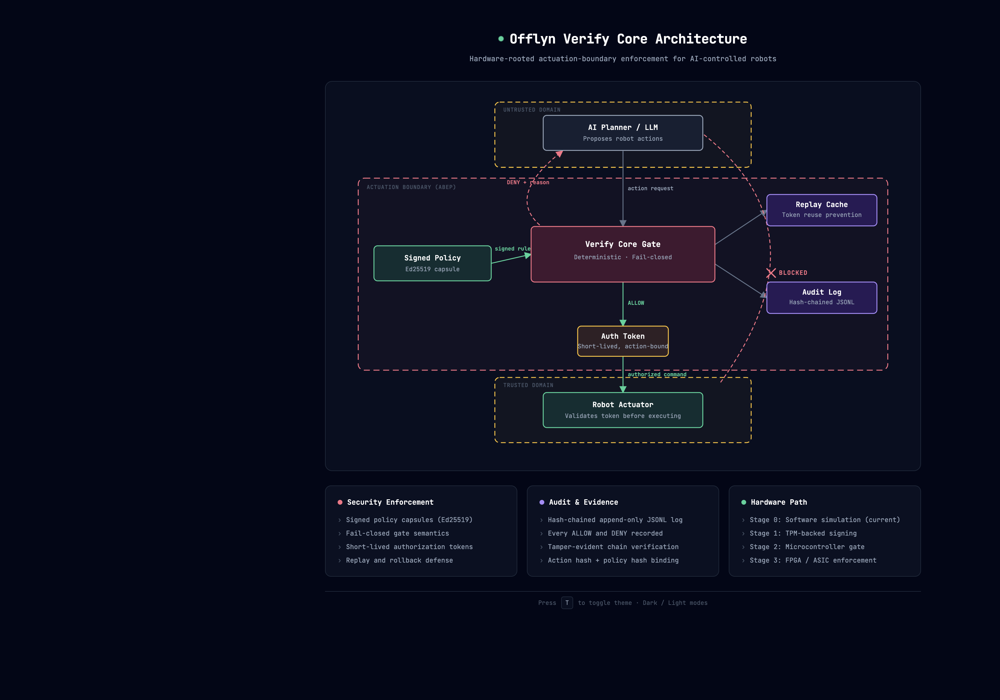

# Policy at the Actuation Boundary: Hardware-Rooted Safety Enforcement for AI-Controlled Robots


**Offlyn Verify Core** is a research prototype for hardware-rooted safety enforcement at the actuation boundary of AI-controlled robots. The system models a small deterministic policy gate placed between an AI planner and robot actuators. The planner may propose actions, but actuators only execute commands that carry a valid, short-lived authorization from the Verify Core gate.

This is not a claim that hardware alone makes robots safe. It is a concrete systems architecture for reducing the trusted computing base of AI-controlled robotic actuation by making the final authorization boundary smaller, auditable, tamper-resistant, and physically harder to bypass.

## Paper

This repository accompanies the draft paper:

**Policy at the Actuation Boundary: Hardware-Rooted Safety Enforcement for AI-Controlled Robots**

- [PDF draft](paper/policy_at_actuation_boundary_offlyn_verify_core_draft_v0_1.pdf)
- [LaTeX source](paper/policy_at_actuation_boundary_offlyn_verify_core_draft_v0_1.tex)
- [v0.1 artifact release](https://github.com/joelnishanth/offlyn-verify-core/releases/tag/v0.1-paper-artifact)

The prototype in `prototype/` implements the paper's core architecture as a reproducible software simulation of a hardware-rooted actuation-boundary enforcement point.

## Architecture



> [Interactive version (dark/light toggle)](docs/diagrams/architecture.html) — open locally in a browser.

**Key idea**: The AI planner proposes robot actions, but it must not talk directly to the actuator. Every action passes through a small deterministic **Verify Core gate**. The gate checks signed policy capsules, evaluates physical bounds, issues short-lived authorization tokens, and logs every decision. The actuator refuses commands without a valid gate-issued token.

## Threat Model Summary

| Threat | Mitigation |
|---|---|
| Compromised planner proposes unsafe action | Gate checks every action against signed policy bounds |
| Planner bypasses gate (direct actuator access) | Actuator rejects commands without valid auth token |
| Replay attack (reuse authorization token) | Tokens are single-use; replay cache rejects duplicates |
| Policy rollback (load older permissive policy) | Monotonic epoch — lower epoch rejected |
| Unsigned policy injection | Ed25519 signature required; unsigned policies rejected |
| Tampered signed policy | Signature verification detects modification |
| Token forgery | HMAC signature on token; actuator verifies before executing |

Full threat model: [docs/threat_model.md](docs/threat_model.md)

## Quick Start

```bash
git clone https://github.com/joelnishanth/offlyn-verify-core.git
cd offlyn-verify-core/prototype
python -m venv .venv
source .venv/bin/activate
pip install -r requirements.txt
```

### Run Tests

```bash
pytest -v
```

### Run Scenarios

```bash
python -m planner.scenarios --scenario safe_move
python -m planner.scenarios --scenario speed_violation
python -m planner.scenarios --scenario angle_violation
python -m planner.scenarios --scenario geofence_violation
python -m planner.scenarios --scenario human_nearby_violation
python -m planner.scenarios --scenario unsigned_policy_update
python -m planner.scenarios --scenario policy_rollback
python -m planner.scenarios --scenario replay_attack
python -m planner.scenarios --scenario direct_actuator_bypass
python -m planner.scenarios --scenario all
```

### Docker

```bash
cd offlyn-verify-core/prototype
docker compose up --build
```

## Demo Output

### Safe movement (allowed)

```
[PLANNER]     Proposed action: move_joint target=joint_2 angle_degrees=45 speed=0.4
[VERIFY_CORE] Decision: ALLOW reason=within_policy_bounds
[ACTUATOR]    Command executed (authorized)
```

### Speed violation (denied)

```
[PLANNER]     Proposed action: move_joint target=joint_2 angle_degrees=30 speed=1.2
[VERIFY_CORE] Decision: DENY reason=speed_exceeds_limit
[ACTUATOR]    Command rejected (no_authorization_token)
```

### Replay attack (denied)

```
[PLANNER]     Proposed action: move_joint target=joint_2 angle_degrees=45 speed=0.4
[VERIFY_CORE] Decision: ALLOW reason=within_policy_bounds
[ACTUATOR]    Command executed (authorized)

[ATTACKER]    Replaying the same authorization token...
[ACTUATOR]    Command rejected (token_replayed)
```

### Direct actuator bypass (denied)

```
[ATTACKER]    Sending command directly to actuator (no gate)...
[ACTUATOR]    Command rejected (no_authorization_token)
```

## Scenario Matrix

| Scenario | Expected Result |
|---|---|
| Normal safe movement | Allowed |
| Speed too high | Denied |
| Joint angle outside range | Denied |
| Robot enters forbidden zone | Denied |
| Human nearby and movement requested | Denied |
| Unsigned policy update | Denied |
| Old policy rollback attempt | Denied |
| Replayed allow token | Denied |
| Planner tries to bypass gate | Denied by architecture |

## Repository Structure

```
offlyn-verify-core/
  README.md                   ← you are here
  paper/
    *.pdf, *.tex              ← draft paper
  prototype/
    planner/                  ← AI planner simulator + scenarios
    policy/                   ← policy compiler, signer, verifier
    gate/                     ← Verify Core gate + decision engine
    actuator_sim/             ← robot arm + drone simulators
    tests/                    ← pytest test suite
  docs/
    architecture.md           ← system architecture
    threat_model.md           ← threat model
    evaluation_plan.md        ← evaluation metrics
    diagrams/                 ← Mermaid diagrams
  examples/                   ← example action requests (JSON)
  results/                    ← sample evaluation results (CSV)
  LICENSE                     ← MIT
  CITATION.cff                ← citation metadata
```

## Mapping to Hardware

This software prototype models an architecture designed for hardware enforcement:

| Prototype Component | Hardware Target |
|---|---|
| Verify Core gate | TPM, secure enclave, FPGA, or ASIC |
| Policy capsule signing | HSM or secure boot chain |
| Replay cache | Hardware monotonic counter + bounded cache |
| Audit log | Tamper-evident storage (signed hash chain) |
| Actuator gate | Hardware I/O interlock (safety relay, FPGA I/O cell) |

The software simulation allows the architecture to be tested, evaluated, and refined before committing to silicon. The path from this prototype to hardware is:

1. **Software prototype** (this repo) — validate architecture and threat model
2. **FPGA prototype** — implement gate logic on programmable hardware
3. **ASIC evaluation** — map to fixed-function silicon for production latency/power targets

## Benchmarking

Run the gate latency benchmark suite:

```bash
cd prototype
python -m gate.benchmark --iterations 10000 --output ../results/benchmark_results.csv
```

This measures policy loading, gate decision latency (allow and deny), authorization token validation, and replay detection. Results are reported as p50, p95, p99, min, max, and mean in milliseconds.

**Important**: These are software-simulation measurements on a general-purpose CPU, not hardware measurements. Latency targets for FPGA or ASIC implementations will be substantially lower. See [docs/hardware_mapping.md](docs/hardware_mapping.md) for the staged path to hardware.

## Reproducibility

The artifact can be reproduced with:

```bash
cd prototype
python -m venv .venv
source .venv/bin/activate
pip install -r requirements.txt
pytest -v
python -m planner.scenarios --scenario all
```

Expected result:

- All 23 tests pass.
- Safe movement is allowed.
- Unsafe speed, angle, geofence, human proximity, unsigned policy, rollback, replay, and direct actuator bypass scenarios fail closed.

## Documentation

- [Architecture](docs/architecture.md)
- [Threat Model](docs/threat_model.md)
- [Evaluation Plan](docs/evaluation_plan.md)
- [Hardware Mapping](docs/hardware_mapping.md)

## License

MIT — see [LICENSE](LICENSE).

## Citation

```bibtex
@software{offlyn_verify_core_2026,
  title  = {Offlyn Verify Core: Policy at the Actuation Boundary},
  year   = {2026},
  url    = {https://github.com/joelnishanth/offlyn-verify-core}
}
```
